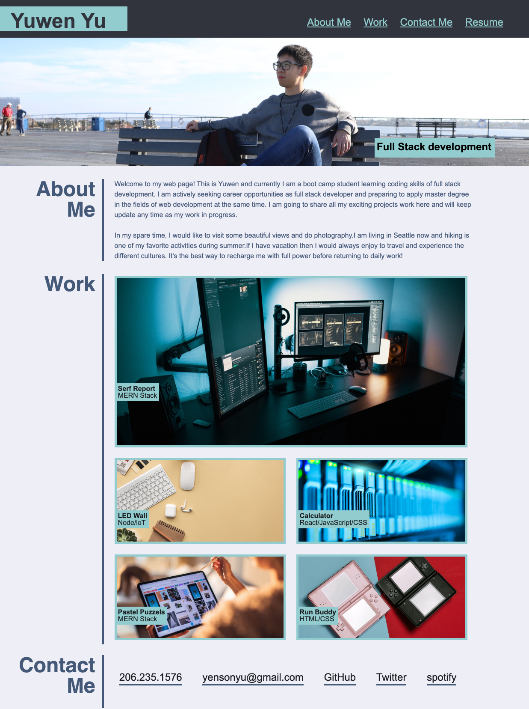
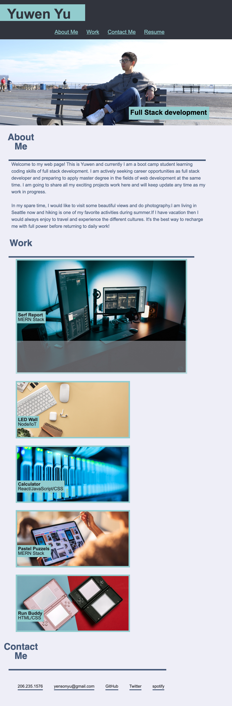

# Portfolio-Template

## Task

The purpose of this porject is to create a portfolio website which is for the reference of my future work. This portfolio is brand new and there will be more designs, functions, and links to deployed application to be updates as progress. 

## Acceptance Criteria

Below are the requirements of the portfolio's appearance and functionlity:

```
GIVEN I need to sample a potential employee's previous work
WHEN I load their portfolio
THEN I am presented with the developer's name, a recent photo, and links to sections about them, their work, and how to contact them
WHEN I click one of the links in the navigation
THEN the UI scrolls to the corresponding section
WHEN I click on the link to the section about their work
THEN the UI scrolls to a section with titled images of the developer's applications
WHEN I am presented with the developer's first application
THEN that application's image should be larger in size than the others
WHEN I click on the images of the applications
THEN I am taken to that deployed application
WHEN I resize the page or view the site on various screens and devices
THEN I am presented with a responsive layout that adapts to my viewport
```

## Appearance of Portfolio:

The following is the appearance of desktop/laptop:



And this is the appearance of smaller tablet:



## URL source
Feel free to check the web application: [https://ywen26.github.io/Portfolio-Template/](https://ywen26.github.io/Portfolio-Template/)

And github repository: [https://github.com/ywen26/Portfolio-Template](https://github.com/ywen26/Portfolio-Template)

## Credits

Image sources: [https://www.pexels.com/](https://www.pexels.com/)